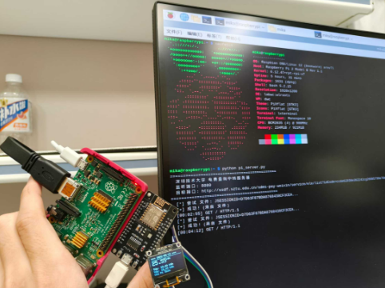
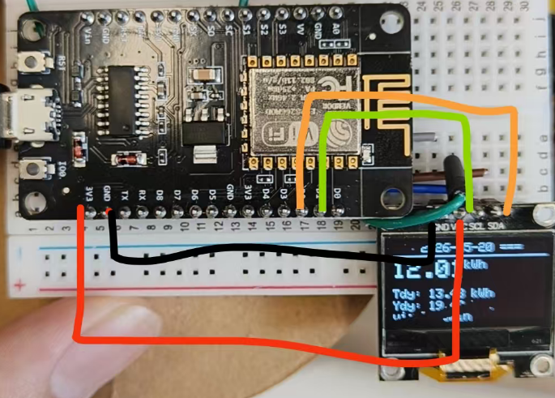
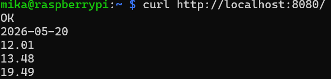
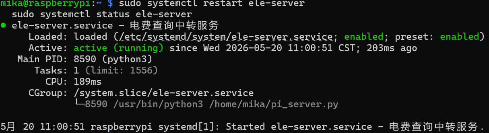
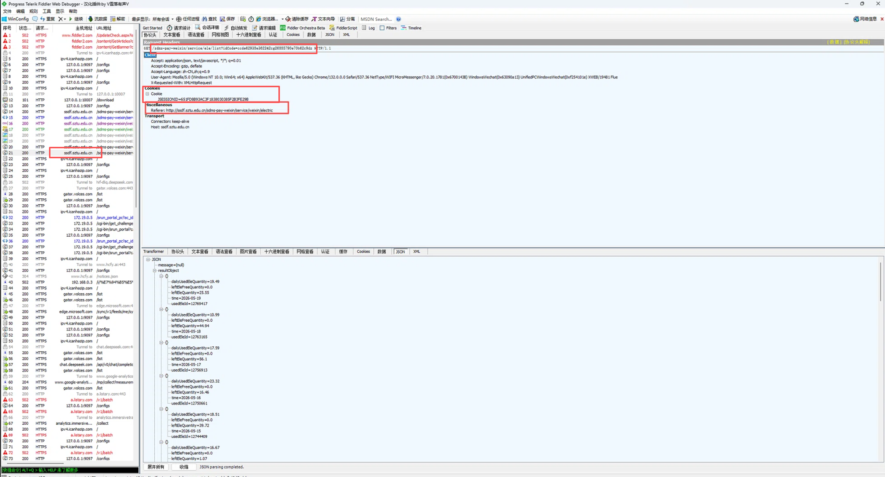
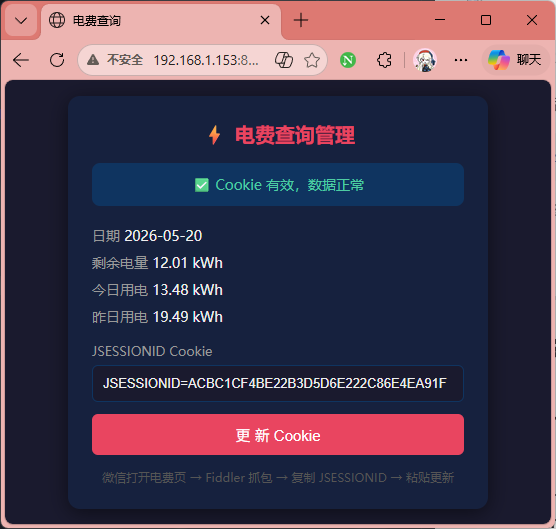
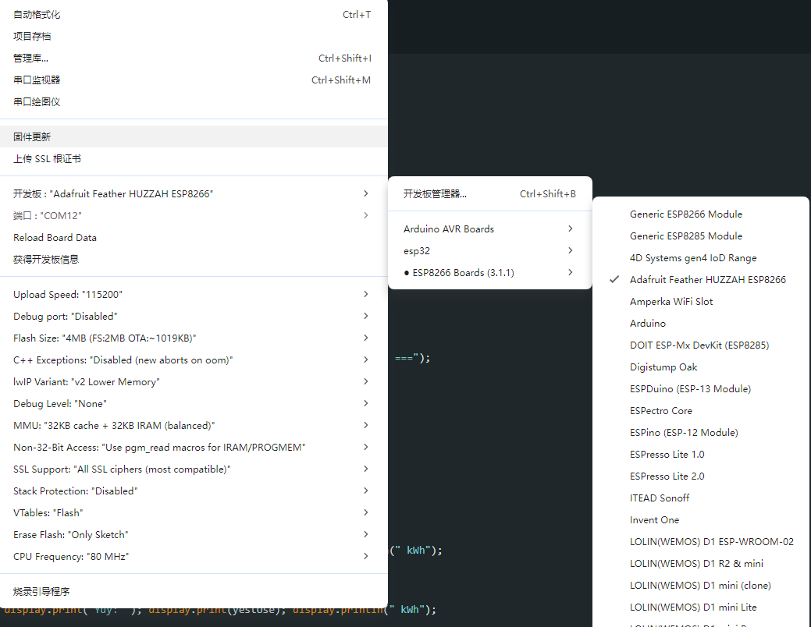
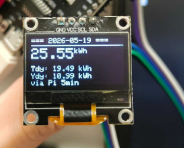

# 深圳技术大学 电费查询 OLED 显示系统

基于 ESP8266 + 0.96" OLED + 树莓派 2B 的宿舍电费实时监控系统。ESP8266 每 5 分钟通过树莓派中转获取学校电费数据，显示在 OLED 屏幕上。

## 系统架构

```
深圳技术大学服务器 (10.1.20.92)
        ↑ HTTP
树莓派 2B (cookie 管理 + 数据中转)
        ↑ HTTP (局域网)
ESP8266 + 0.96" OLED (显示终端)
```

- **树莓派**：负责携带 Cookie 请求学校 API，自动续期 Session，提供管理页面
- **ESP8266**：每 5 分钟从树莓派拉取解析好的纯文本数据，驱动 OLED 显示
- **路由器**：需配置校内 DNS 劫持（学校域名公网不可解析）

---

## 一、硬件清单

| 硬件 | 型号 | 用途 |
|------|------|------|
| WiFi 模块 | ESP8266 NodeMCU | 主控 + WiFi + 显示驱动 |
| OLED 屏幕 | 0.96 寸 SSD1306 I2C (128×64) | 显示电费信息 |
| 单板电脑 | 树莓派 2B | Cookie 管理 + HTTP 中转 |
| 路由器 | OpenWrt (2.4GHz) | 局域网 + 校内 DNS 劫持 |
| 杜邦线 | 母对母 ×4 | 连接 OLED |

### 接线图

```
OLED 屏            ESP8266 板
---------          -------------
VCC     ────────   3.3V (3V3)
GND     ────────   GND
SCL     ────────   D1 (GPIO5)
SDA     ────────   D2 (GPIO4)
```

> 4 根线即可，不需要任何额外元件。ESP8266 用 Micro USB 供电。

---

## 二、路由器配置

学校域名 `ssdf.sztu.edu.cn` 解析到校内 IP `10.1.20.92`，公网 DNS 无法解析。需在路由器上配置 DNS 劫持或 hosts。

SSH 登录路由器：

```bash
# DNS 劫持
echo "10.1.20.92  ssdf.sztu.edu.cn" >> /etc/hosts
/etc/init.d/dnsmasq restart
```

如果没有路由器 SSH 权限，也可在树莓派上单独配置（见第三步）。

---

## 三、树莓派部署

### 3.1 固定 IP

```bash
sudo nano /etc/dhcpcd.conf
```

末尾添加：

```
interface wlan0
static ip_address=192.168.1.你的pi的实际ip/24
static routers=192.168.1.1
```

### 3.2 DNS 解析（如果路由器没配）

```bash
sudo nano /etc/hosts
```

添加：

```
10.1.20.92  ssdf.sztu.edu.cn
```

### 3.3 部署中转服务

将 `pi_server.py` 复制到 `~`，然后：

```bash
# 测试运行
python3 ~/pi_server.py

# 另开终端验证
curl http://localhost:8080/
```

应当看见“OK”开头的字段返回，如图


### 3.4 配置开机自启 + 崩溃重启

```bash
sudo nano /etc/systemd/system/ele-server.service
```

写入：

```ini
[Unit]
Description=电费查询中转服务
After=network.target
Wants=network.target

[Service]
Type=simple
ExecStart=/usr/bin/python3 /你的pi_server.py放在哪里的绝对地址
Restart=always
RestartSec=30
User=你的名字
WorkingDirectory=/home/你的名字

[Install]
WantedBy=multi-user.target
```

启用：

```bash
sudo systemctl daemon-reload
sudo systemctl enable ele-server
sudo systemctl start ele-server
sudo systemctl status ele-server   # 确认 active (running)
```
成功效果图：


### 3.5 首次初始化 Cookie

Pi 服务启动后，需要先写入一个有效的 JSESSIONID。从 Fiddler 抓取到 Cookie 后：


```bash
echo "JSESSIONID=你的Cookie值" > /home/mika/cookie.txt
```

之后可以通过浏览器管理页面（http://192.168.1.pi的IP地址:8080/admin） 更新（不再需要 SSH）。

如图：


---

## 四、ESP8266 部署

### 4.1 Arduino IDE 安装库

「项目」→「加载库」→「管理库」，搜索安装：

- **Adafruit SSD1306**
- **Adafruit GFX Library**

### 4.2 修改配置

打开 `electric_meter.ino`，确认以下配置正确：

```cpp
const char* WIFI_SSID = "WIFI名称";
const char* WIFI_PASS = "WIFI密码";
const char* PI_HOST   = "192.168.1.Pi的IP地址";  // 树莓派 IP
```

### 4.3 烧录

- 开发板选择：如图
- 端口：选择 ESP8266 对应的 COM 口
- 点上传（→），等待编译烧录完成

烧录成功后 OLED 会自动显示电费数据。

---

## 五、日常使用

### 正常运行状态

OLED 显示：

```
=== 2026-05-20 ===
 25.55 kWh       （剩余电量，大字体）
Tdy: 19.49 kWh   （今日用电）
Ydy: 10.99 kWh   （昨日用电）
```


每 5 分钟自动刷新。

### Cookie 过期时

OLED 显示 `ERR` 或 `Cookie err`，需要更新 Cookie：

1. 电脑打开微信 → 进入电费查询页面（确保能正常加载）
2. 打开 Fiddler，刷新电费页面，找到 `ssdf.sztu.edu.cn/sdms-pay-weixin/service/ele/list` 这条请求
3. 右侧 Inspectors → 找到 `Cookie: JSESSIONID=xxx`，完整复制
4. 浏览器打开 `http://192.168.1.153:8080/admin`
5. 粘贴 JSESSIONID，点击「更新 Cookie」
6. 等待下一个刷新周期（最多 5 分钟），或按 ESP8266 的 RST 键立即刷新

> **技巧**：在 Windows 桌面创建 `更新电费Cookie.bat`，双击粘贴一键更新：
> ```batch
> @echo off
> chcp 65001 >nul
> set /p COOKIE="粘贴 JSESSIONID: "
> curl -s "http://192.168.1.153:8080/save?cookie=%COOKIE%"
> echo 更新完成 & pause
> ```

### 树莓派断电后

树莓派通电开机后服务自动启动。如果断电超过 30 分钟，Cookie 可能过期，按上一节操作更新即可。

---

## 六、API 接口说明

| 项目 | 值 |
|------|-----|
| 域名 | `ssdf.sztu.edu.cn` |
| 实际 IP | `10.1.20.92` |
| 端口 | 80 (HTTP) |
| 路径 | `/sdms-pay-weixin/service/ele/list` |
| 参数 | `?idCode=ccde62938e362242cg26885790e70b62c9dz` |
| Cookie | `JSESSIONID=xxx` (需 Fiddler 抓取) |
| 必需请求头 | `Referer`, `X-Requested-With: XMLHttpRequest`, `Accept: application/json` |
| 服务器 | Apache-Coyote/1.1 (Tomcat) |

### 返回 JSON 字段

| 字段 | 含义 | 单位 |
|------|------|------|
| `leftEleQuantity` | 当日剩余电量 | kWh |
| `dailyUsedEleQuantity` | 当日已用电量 | kWh |
| `time` | 日期 | yyyy-MM-dd |
| `usedEleId` | 记录 ID | — |
| `leftEleFreeQuantity` | 剩余免费电量 | kWh |

---

## 七、故障排查

| 现象 | 可能原因 | 解决 |
|------|---------|------|
| OLED 显示 `HTTP -1` | 连不上树莓派 | 检查树莓派是否开机，IP 是否变动 |
| OLED 显示 `HTTP 502` | Cookie 过期 | 按第五节方法更新 Cookie |
| `Address already in use` | 已有 pi_server 在跑 | `sudo pkill -f pi_server.py` 后重启 |
| `404 Not Found` | 路径拼写错误 | 确认是 `weixin` 不是 `wexin` |
| `Connection refused` | Pi 的 SSH 未启用 | `sudo raspi-config` → SSH → Enable |

---

## 八、项目文件

```
电费计费表/
├── README.md                   # 本文件
├── pi_server.py                # 树莓派中转服务器
├── pic/                        #本文件用到的图片
├── electric_meter/
│   └── electric_meter.ino      # ESP8266 Arduino 代码
```

## 九、技术栈

- **ESP8266**：C++ (Arduino), Adafruit SSD1306/GFX
- **树莓派**：Python 3, http.server, urllib
- **网络**：HTTP/1.1, OpenWrt DNS hijack, systemd
- **调试**：Fiddler Classic（Windows 抓包获取 Cookie）
- **路由器**：OpenWrt，[具体可看这个仓库](https://github.com/Mrkuzumi/Newwifi3-D2_link_to_sztu)
